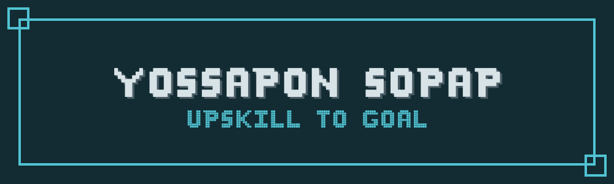

  

Hi, I'm Yossapon 👋

  Python Developer · Learning every day

  

## 🎯 About Me

- 🔭 Currently building projects with **Python**
- 🌱 Learning **Backend · Automation · Machine Learning**
- 🤖 Interested in **AI · Data · Developer Tools**
- 🎯 Goal: Work behind the scenes, let the data do the talking
- 🎮 Also a **Gaming YouTuber** & creative with **Canva · DaVinci Resolve**
- ⚡ I fix bugs more than I write code — and I'm okay with that

 

## 🧰 Tech Stack

**Languages**

**Libraries**

**Tools & Platforms**

 

## 🎨 Content Creation

  
  
  

 

## 📊 GitHub Stats

  <!--  -->
  

  

 

## 🍵 Support / Donate 

If you find my work useful, feel free to support me!

> *"Small progress is still progress."*