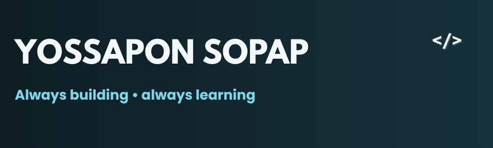

  

<h1 align="center">Hi, I'm Yossapon 👋</h1>

Python Developer • Backend • Automation • Never stop Learning

  

## 🎯 About Me
- Currently building projects with **Python**
- Learning **Backend, Automation, and Machine Learning** step by step
- Interested in **AI, Data, and Developer Tools**
- Goal: Build useful systems and let the data do the talking
- Enjoy learning through real projects and hands-on problem solving

 

## 🧰 Tech Stack

**Languages & Web**

  

**Frameworks & Database**

  

**Tools**

  

**Data Tools**

  
  
  

 

## 📌 Current Projects

- **BrewFlow**  
  A drink recipe manager web app built with **Flask** and **SQLite**

- **Python Learning Projects**  
  Focused on backend logic, automation, and problem-solving practice

- **Frontend UI Practice**  
  Exploring cleaner layouts and better user experience with **HTML, CSS, and JavaScript**

 

## 🍵 Support

If you like my work and want to support my learning journey, you can buy me a tea here:

> *"Small progress is still progress."*